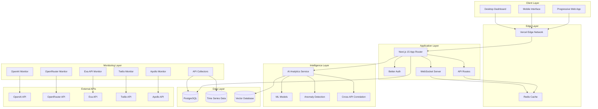

# Technical Architecture - Nexus API Monitoring Dashboard

## Architecture Overview

The Nexus API Monitoring Dashboard employs a modern, scalable architecture designed for real-time monitoring, AI-powered analytics, and futuristic user experiences. The system is built on Next.js 15 with a robust backend infrastructure capable of handling high-frequency API monitoring across multiple providers.

### Core Principles
- **Real-time First:** Sub-second data updates across all monitoring interfaces
- **AI-Driven Intelligence:** Machine learning for anomaly detection and alert optimization
- **Mobile-Responsive:** Progressive Web App with offline capabilities
- **Scalable Foundation:** Architecture supports monitoring hundreds of APIs
- **Security-Focused:** Enterprise-grade security for API keys and sensitive data

---

## System Architecture Diagram



---

## Technology Stack

### Frontend Architecture

#### Core Framework
- **Next.js 15** with App Router for file-based routing and React Server Components
- **React 18** with Suspense and Concurrent Features
- **TypeScript** with strict mode for type safety
- **Tailwind CSS 4** for utility-first styling

#### UI & Components
- **shadcn/ui** for consistent component library
- **Framer Motion** for advanced animations and transitions
- **Recharts** for data visualization and real-time charts
- **React Hook Form** with Zod validation for forms

#### State Management
- **Zustand** for client-side state management
- **TanStack Query** for server state and caching
- **WebSocket** for real-time data synchronization
- **Local Storage** for user preferences and offline data

#### Performance & PWA
- **Vercel Edge Runtime** for optimal performance
- **Service Workers** for offline functionality
- **Web Push API** for notifications
- **IndexedDB** for offline data storage

### Backend Architecture

#### Core Infrastructure
- **Next.js API Routes** for serverless functions
- **Better Auth** for authentication and session management
- **Drizzle ORM** with PostgreSQL for type-safe database operations
- **WebSocket Server** for real-time communication

#### Database Layer
- **PostgreSQL 15** as primary database
- **Connection Pooling** via PgBouncer
- **Time Series Extensions** for efficient metrics storage
- **Redis** for caching and real-time data

#### API Monitoring Engine
- **Node.js Workers** for API polling and monitoring
- **Queue System** for reliable job processing
- **Rate Limiting** with exponential backoff
- **Circuit Breakers** for resilient API calls

#### AI & Analytics
- **TensorFlow.js** for client-side ML inference
- **Python Microservices** for complex ML models
- **Vector Database** for similarity search and pattern matching
- **Real-time Analytics Engine** for live insights

### Infrastructure & DevOps

#### Hosting & Deployment
- **Vercel** for frontend hosting and serverless functions
- **Railway** for backend services and database
- **Docker** containers for service isolation
- **GitHub Actions** for CI/CD pipeline

#### Monitoring & Observability
- **Vercel Analytics** for performance monitoring
- **Sentry** for error tracking and performance
- **Custom Metrics Dashboard** for system health
- **Log Aggregation** with structured logging

#### Security
- **HTTPS Everywhere** with TLS 1.3
- **API Key Encryption** with AES-256
- **Rate Limiting** per user and API endpoint
- **CSRF Protection** and secure headers

---

## Database Schema Design

### Core Tables

#### User Management
```sql
-- Users table with enhanced profile data
CREATE TABLE users (
    id TEXT PRIMARY KEY,
    name TEXT NOT NULL,
    email TEXT UNIQUE NOT NULL,
    email_verified BOOLEAN DEFAULT FALSE,
    image TEXT,
    role TEXT DEFAULT 'user', -- user, admin, observer
    preferences JSONB, -- UI preferences, notification settings
    created_at TIMESTAMP DEFAULT NOW(),
    updated_at TIMESTAMP DEFAULT NOW()
);

-- Enhanced API providers with monitoring configuration
CREATE TABLE api_providers (
    id TEXT PRIMARY KEY,
    name TEXT UNIQUE NOT NULL,
    display_name TEXT NOT NULL,
    description TEXT,
    base_url TEXT,
    status TEXT DEFAULT 'active',
    monitoring_config JSONB, -- provider-specific settings
    rate_limits JSONB, -- rate limiting configuration
    cost_model JSONB, -- pricing structure
    created_at TIMESTAMP DEFAULT NOW(),
    updated_at TIMESTAMP DEFAULT NOW()
);
```

#### API Keys & Security
```sql
-- Secure API key storage with metadata
CREATE TABLE api_keys (
    id TEXT PRIMARY KEY,
    user_id TEXT REFERENCES users(id) ON DELETE CASCADE,
    provider_id TEXT REFERENCES api_providers(id) ON DELETE CASCADE,
    name TEXT NOT NULL,
    key_hash TEXT NOT NULL, -- bcrypt hashed
    key_preview TEXT NOT NULL, -- last 4 characters for identification
    permissions JSONB, -- scoped permissions
    last_used TIMESTAMP,
    usage_count INTEGER DEFAULT 0,
    is_active BOOLEAN DEFAULT TRUE,
    expires_at TIMESTAMP,
    created_at TIMESTAMP DEFAULT NOW(),
    updated_at TIMESTAMP DEFAULT NOW()
);

-- API key rotation and audit log
CREATE TABLE api_key_audit (
    id TEXT PRIMARY KEY,
    api_key_id TEXT REFERENCES api_keys(id),
    action TEXT NOT NULL, -- created, rotated, revoked, used
    metadata JSONB,
    ip_address INET,
    user_agent TEXT,
    created_at TIMESTAMP DEFAULT NOW()
);
```

#### Metrics & Monitoring
```sql
-- High-performance metrics table with partitioning
CREATE TABLE api_metrics (
    id TEXT PRIMARY KEY,
    provider_id TEXT REFERENCES api_providers(id),
    user_id TEXT REFERENCES users(id),
    api_key_id TEXT REFERENCES api_keys(id),
    endpoint TEXT NOT NULL,
    method TEXT NOT NULL,
    status_code INTEGER NOT NULL,
    response_time INTEGER, -- milliseconds
    request_size INTEGER, -- bytes
    response_size INTEGER, -- bytes
    cost DECIMAL(10,6), -- calculated cost
    tokens JSONB, -- AI token usage
    metadata JSONB, -- provider-specific data
    error_details JSONB, -- error information if applicable
    correlation_id TEXT, -- for cross-API correlation
    timestamp TIMESTAMP DEFAULT NOW()
) PARTITION BY RANGE (timestamp);

-- Create monthly partitions for better performance
CREATE TABLE api_metrics_y2025m01 PARTITION OF api_metrics
    FOR VALUES FROM ('2025-01-01') TO ('2025-02-01');
```

#### AI & Analytics
```sql
-- Anomaly detection results
CREATE TABLE anomalies (
    id TEXT PRIMARY KEY,
    provider_id TEXT REFERENCES api_providers(id),
    user_id TEXT REFERENCES users(id),
    type TEXT NOT NULL, -- latency, error_rate, cost, usage
    severity TEXT NOT NULL, -- low, medium, high, critical
    confidence DECIMAL(3,2), -- 0.00 to 1.00
    baseline_value DECIMAL(15,6),
    actual_value DECIMAL(15,6),
    deviation_percentage DECIMAL(5,2),
    time_window_start TIMESTAMP NOT NULL,
    time_window_end TIMESTAMP NOT NULL,
    metadata JSONB, -- ML model details, feature importance
    is_resolved BOOLEAN DEFAULT FALSE,
    resolved_at TIMESTAMP,
    created_at TIMESTAMP DEFAULT NOW()
);

-- Cross-API correlation patterns
CREATE TABLE correlation_patterns (
    id TEXT PRIMARY KEY,
    pattern_type TEXT NOT NULL, -- cascade_failure, compensation, dependency
    providers JSONB NOT NULL, -- array of provider IDs involved
    trigger_conditions JSONB, -- conditions that activate pattern
    expected_effects JSONB, -- predicted downstream effects
    confidence DECIMAL(3,2),
    observed_count INTEGER DEFAULT 0,
    last_observed TIMESTAMP,
    is_active BOOLEAN DEFAULT TRUE,
    created_at TIMESTAMP DEFAULT NOW(),
    updated_at TIMESTAMP DEFAULT NOW()
);
```

### Indexing Strategy

```sql
-- Performance-critical indexes
CREATE INDEX CONCURRENTLY idx_api_metrics_timestamp ON api_metrics (timestamp DESC);
CREATE INDEX CONCURRENTLY idx_api_metrics_provider_time ON api_metrics (provider_id, timestamp DESC);
CREATE INDEX CONCURRENTLY idx_api_metrics_user_time ON api_metrics (user_id, timestamp DESC);
CREATE INDEX CONCURRENTLY idx_api_metrics_correlation ON api_metrics (correlation_id) WHERE correlation_id IS NOT NULL;
CREATE INDEX CONCURRENTLY idx_anomalies_time_severity ON anomalies (created_at DESC, severity);
CREATE INDEX CONCURRENTLY idx_alerts_user_unread ON alerts (user_id, is_read, created_at DESC);

-- Composite indexes for complex queries
CREATE INDEX CONCURRENTLY idx_metrics_provider_status_time 
    ON api_metrics (provider_id, status_code, timestamp DESC);
CREATE INDEX CONCURRENTLY idx_metrics_cost_analysis 
    ON api_metrics (user_id, provider_id, timestamp DESC) 
    WHERE cost IS NOT NULL;
```

---

## API Architecture

### RESTful API Endpoints

#### Authentication & Users
```typescript
// User management
GET    /api/auth/session          // Get current session
POST   /api/auth/signin           // Sign in user
POST   /api/auth/signup           // Register new user
POST   /api/auth/signout          // Sign out user
GET    /api/users/profile         // Get user profile
PATCH  /api/users/profile         // Update user profile
GET    /api/users/preferences     // Get user preferences
PATCH  /api/users/preferences     // Update preferences
```

#### API Providers & Keys
```typescript
// Provider management
GET    /api/providers             // List all providers
GET    /api/providers/:id         // Get provider details
POST   /api/providers/:id/test    // Test provider connectivity

// API key management
GET    /api/keys                  // List user's API keys
POST   /api/keys                  // Create new API key
GET    /api/keys/:id              // Get API key details
PATCH  /api/keys/:id              // Update API key
DELETE /api/keys/:id              // Delete API key
POST   /api/keys/:id/rotate       // Rotate API key
POST   /api/keys/:id/test         // Test API key
```

#### Monitoring & Metrics
```typescript
// Real-time monitoring
GET    /api/monitoring/status     // Overall system status
GET    /api/monitoring/providers  // Provider status summary
GET    /api/monitoring/realtime   // Real-time metrics stream

// Historical metrics
GET    /api/metrics               // Query metrics with filters
GET    /api/metrics/summary       // Aggregated metrics
GET    /api/metrics/trends        // Trend analysis
GET    /api/metrics/costs         // Cost analysis

// Analytics
GET    /api/analytics/anomalies   // Detected anomalies
GET    /api/analytics/patterns    // Usage patterns
GET    /api/analytics/correlations // Cross-API correlations
GET    /api/analytics/predictions  // Predictive insights
```

#### Alerts & Notifications
```typescript
// Alert management
GET    /api/alerts                // List user alerts
POST   /api/alerts                // Create alert rule
GET    /api/alerts/:id            // Get alert details
PATCH  /api/alerts/:id            // Update alert rule
DELETE /api/alerts/:id            // Delete alert rule
POST   /api/alerts/:id/test       // Test alert rule

// Notification settings
GET    /api/notifications/settings // Get notification preferences
PATCH  /api/notifications/settings // Update preferences
POST   /api/notifications/test     // Test notification delivery
```

### WebSocket API

#### Real-time Data Streams
```typescript
// WebSocket connection endpoints
ws://api.nexus.dev/ws/metrics      // Real-time metrics stream
ws://api.nexus.dev/ws/alerts       // Live alert notifications
ws://api.nexus.dev/ws/status       // Provider status updates
ws://api.nexus.dev/ws/correlations // Live correlation detection

// Message formats
interface MetricUpdate {
  type: 'metric';
  provider: string;
  endpoint: string;
  metrics: {
    responseTime: number;
    statusCode: number;
    cost?: number;
    timestamp: string;
  };
}

interface AlertNotification {
  type: 'alert';
  severity: 'low' | 'medium' | 'high' | 'critical';
  title: string;
  message: string;
  provider?: string;
  actionRequired: boolean;
  timestamp: string;
}

interface StatusUpdate {
  type: 'status';
  provider: string;
  status: 'operational' | 'degraded' | 'outage';
  details?: string;
  timestamp: string;
}
```

---

## AI & Machine Learning Architecture

### Anomaly Detection System

#### Multi-layered Detection
```typescript
// Statistical anomaly detection
class StatisticalDetector {
  detectOutliers(metrics: Metric[], windowSize: number): Anomaly[] {
    // Z-score based detection
    // Isolation Forest for multivariate analysis
    // Time series decomposition
  }
}

// Machine learning based detection
class MLAnomalyDetector {
  private model: TensorFlowModel;
  
  async detectAnomalies(timeSeries: TimeSeriesData): Promise<Anomaly[]> {
    // LSTM autoencoder for sequence anomalies
    // Random Forest for feature-based detection
    // Ensemble voting for final prediction
  }
}

// Real-time streaming detection
class StreamingDetector {
  processMetric(metric: Metric): Promise<Anomaly | null> {
    // Online learning algorithms
    // Sliding window analysis
    // Immediate alert generation
  }
}
```

#### Alert Prioritization ML Model
```python
# Alert scoring model (Python microservice)
class AlertPriorityModel:
    def __init__(self):
        self.model = self.load_trained_model()
        self.feature_extractor = FeatureExtractor()
    
    def predict_priority(self, alert_data):
        features = self.feature_extractor.extract(alert_data)
        # Features: historical impact, user behavior, time of day,
        # provider reliability, cost implications, user context
        
        priority_score = self.model.predict(features)
        confidence = self.model.predict_proba(features)
        
        return {
            'priority': priority_score,
            'confidence': confidence,
            'reasoning': self.explain_prediction(features)
        }
```

### Cross-API Correlation Engine

#### Pattern Recognition
```typescript
class CorrelationEngine {
  private patterns: Map<string, CorrelationPattern> = new Map();
  
  async detectCorrelations(events: APIEvent[]): Promise<Correlation[]> {
    // Time-window based correlation
    const timeWindows = this.createTimeWindows(events, 300000); // 5 min windows
    
    // Statistical correlation analysis
    const correlations = await Promise.all(
      timeWindows.map(window => this.analyzeWindow(window))
    );
    
    // Pattern matching against known patterns
    const knownPatterns = this.matchKnownPatterns(correlations);
    
    // Novel pattern discovery
    const novelPatterns = this.discoverNewPatterns(correlations);
    
    return [...knownPatterns, ...novelPatterns];
  }
  
  private async analyzeWindow(events: APIEvent[]): Promise<Correlation[]> {
    // Pearson correlation for continuous metrics
    // Mutual information for categorical events
    // Granger causality for temporal relationships
  }
}
```

### Predictive Analytics

#### Cost Prediction Model
```typescript
class CostPredictor {
  async predictCosts(
    provider: string,
    timeHorizon: number,
    userPattern: UserUsagePattern
  ): Promise<CostPrediction> {
    // Historical usage analysis
    const historicalData = await this.getHistoricalUsage(provider);
    
    // Seasonal pattern detection
    const seasonality = this.detectSeasonality(historicalData);
    
    // Trend analysis
    const trends = this.analyzeTrends(historicalData);
    
    // Feature engineering
    const features = this.extractFeatures({
      historical: historicalData,
      seasonality,
      trends,
      userPattern,
      externalFactors: await this.getExternalFactors()
    });
    
    // Model prediction
    const prediction = await this.model.predict(features);
    
    return {
      predictedCost: prediction.cost,
      confidence: prediction.confidence,
      breakdown: prediction.breakdown,
      factors: prediction.influencingFactors,
      recommendations: this.generateRecommendations(prediction)
    };
  }
}
```

---

## Performance Optimization Strategy

### Frontend Performance

#### Code Splitting & Lazy Loading
```typescript
// Route-based code splitting
const DashboardPage = lazy(() => import('@/app/dashboard/page'));
const AnalyticsPage = lazy(() => import('@/app/analytics/page'));
const AlertsPage = lazy(() => import('@/app/alerts/page'));

// Component-based lazy loading
const HeavyChart = lazy(() => import('@/components/charts/heavy-chart'));
const DataTable = lazy(() => import('@/components/data-table'));

// Dynamic imports for features
const loadAdvancedAnalytics = () => 
  import('@/lib/advanced-analytics').then(module => module.AdvancedAnalytics);
```

#### Real-time Data Optimization
```typescript
// Efficient WebSocket data handling
class OptimizedWebSocketManager {
  private updateQueue: Map<string, any> = new Map();
  private batchUpdateTimer: NodeJS.Timeout | null = null;
  
  handleMessage(message: WebSocketMessage) {
    // Batch updates to prevent excessive re-renders
    this.updateQueue.set(message.id, message.data);
    
    if (!this.batchUpdateTimer) {
      this.batchUpdateTimer = setTimeout(() => {
        this.flushUpdates();
        this.batchUpdateTimer = null;
      }, 16); // ~60fps
    }
  }
  
  private flushUpdates() {
    const updates = Array.from(this.updateQueue.values());
    this.updateQueue.clear();
    
    // Batch update React state
    this.setState(prevState => ({
      ...prevState,
      ...this.mergeUpdates(updates)
    }));
  }
}
```

#### Caching Strategy
```typescript
// Multi-layer caching approach
class CacheManager {
  // 1. In-memory cache for hot data
  private memoryCache = new LRUCache<string, any>({
    max: 1000,
    ttl: 5 * 60 * 1000 // 5 minutes
  });
  
  // 2. Redis for distributed caching
  private redisCache = new Redis(process.env.REDIS_URL);
  
  // 3. Browser cache for static data
  private browserCache = 'nexus-cache-v1';
  
  async get(key: string): Promise<any> {
    // Check memory cache first
    let data = this.memoryCache.get(key);
    if (data) return data;
    
    // Check Redis cache
    data = await this.redisCache.get(key);
    if (data) {
      this.memoryCache.set(key, JSON.parse(data));
      return JSON.parse(data);
    }
    
    // Check browser cache (for static data)
    if (typeof window !== 'undefined') {
      const cache = await caches.open(this.browserCache);
      const response = await cache.match(key);
      if (response) {
        data = await response.json();
        this.memoryCache.set(key, data);
        return data;
      }
    }
    
    return null;
  }
}
```

### Backend Performance

#### Database Optimization
```sql
-- Optimized queries with proper indexing
-- Real-time metrics query (sub-100ms target)
SELECT 
    provider_id,
    AVG(response_time) as avg_response_time,
    COUNT(*) as request_count,
    SUM(CASE WHEN status_code >= 400 THEN 1 ELSE 0 END) as error_count,
    SUM(cost) as total_cost
FROM api_metrics 
WHERE 
    user_id = $1 
    AND timestamp >= NOW() - INTERVAL '5 minutes'
    AND timestamp <= NOW()
GROUP BY provider_id
ORDER BY provider_id;

-- Use materialized views for heavy aggregations
CREATE MATERIALIZED VIEW hourly_metrics_summary AS
SELECT 
    provider_id,
    user_id,
    DATE_TRUNC('hour', timestamp) as hour,
    AVG(response_time) as avg_response_time,
    PERCENTILE_CONT(0.95) WITHIN GROUP (ORDER BY response_time) as p95_response_time,
    COUNT(*) as request_count,
    SUM(cost) as total_cost
FROM api_metrics
GROUP BY provider_id, user_id, DATE_TRUNC('hour', timestamp);

-- Refresh materialized view every 15 minutes
CREATE OR REPLACE FUNCTION refresh_hourly_summary()
RETURNS void AS $$
BEGIN
    REFRESH MATERIALIZED VIEW CONCURRENTLY hourly_metrics_summary;
END;
$$ LANGUAGE plpgsql;
```

#### API Rate Limiting & Circuit Breakers
```typescript
// Intelligent rate limiting
class AdaptiveRateLimiter {
  private limits: Map<string, RateLimit> = new Map();
  
  async checkLimit(provider: string, user: string): Promise<boolean> {
    const key = `${provider}:${user}`;
    const limit = this.limits.get(key) || this.getDefaultLimit(provider);
    
    // Dynamic adjustment based on provider health
    const providerHealth = await this.getProviderHealth(provider);
    const adjustedLimit = this.adjustLimitForHealth(limit, providerHealth);
    
    return this.enforceLimit(key, adjustedLimit);
  }
  
  private adjustLimitForHealth(limit: RateLimit, health: number): RateLimit {
    // Reduce limits when provider is struggling
    const factor = Math.max(0.1, health / 100);
    return {
      ...limit,
      requestsPerMinute: Math.floor(limit.requestsPerMinute * factor)
    };
  }
}

// Circuit breaker for external API calls
class CircuitBreaker {
  private state: 'CLOSED' | 'OPEN' | 'HALF_OPEN' = 'CLOSED';
  private failures = 0;
  private lastFailureTime = 0;
  
  async execute<T>(operation: () => Promise<T>): Promise<T> {
    if (this.state === 'OPEN') {
      if (Date.now() - this.lastFailureTime > this.timeout) {
        this.state = 'HALF_OPEN';
      } else {
        throw new Error('Circuit breaker is OPEN');
      }
    }
    
    try {
      const result = await operation();
      this.onSuccess();
      return result;
    } catch (error) {
      this.onFailure();
      throw error;
    }
  }
  
  private onFailure() {
    this.failures++;
    this.lastFailureTime = Date.now();
    
    if (this.failures >= this.threshold) {
      this.state = 'OPEN';
    }
  }
}
```

---

## Security Architecture

### API Key Security

#### Encryption & Storage
```typescript
// Secure API key handling
class SecureKeyManager {
  private readonly algorithm = 'aes-256-gcm';
  private readonly keyDerivation = 'pbkdf2';
  
  async encryptApiKey(plainKey: string, userId: string): Promise<EncryptedKey> {
    // Generate user-specific salt
    const salt = crypto.randomBytes(32);
    
    // Derive encryption key from master secret + user salt
    const derivedKey = crypto.pbkdf2Sync(
      process.env.MASTER_KEY!,
      salt,
      100000, // iterations
      32, // key length
      'sha512'
    );
    
    // Encrypt API key
    const iv = crypto.randomBytes(16);
    const cipher = crypto.createCipher(this.algorithm, derivedKey);
    cipher.setAAD(Buffer.from(userId)); // Additional authenticated data
    
    let encrypted = cipher.update(plainKey, 'utf8', 'base64');
    encrypted += cipher.final('base64');
    
    const authTag = cipher.getAuthTag();
    
    return {
      encrypted,
      salt: salt.toString('base64'),
      iv: iv.toString('base64'),
      authTag: authTag.toString('base64'),
      hash: await bcrypt.hash(plainKey, 12) // For verification without decryption
    };
  }
  
  async decryptApiKey(encryptedKey: EncryptedKey, userId: string): Promise<string> {
    // Derive the same encryption key
    const derivedKey = crypto.pbkdf2Sync(
      process.env.MASTER_KEY!,
      Buffer.from(encryptedKey.salt, 'base64'),
      100000,
      32,
      'sha512'
    );
    
    // Decrypt
    const decipher = crypto.createDecipher(
      this.algorithm, 
      derivedKey,
      Buffer.from(encryptedKey.iv, 'base64')
    );
    
    decipher.setAAD(Buffer.from(userId));
    decipher.setAuthTag(Buffer.from(encryptedKey.authTag, 'base64'));
    
    let decrypted = decipher.update(encryptedKey.encrypted, 'base64', 'utf8');
    decrypted += decipher.final('utf8');
    
    return decrypted;
  }
}
```

#### Permission System
```typescript
// Role-based access control
interface Permission {
  resource: string;
  actions: string[];
  conditions?: Record<string, any>;
}

interface Role {
  name: string;
  permissions: Permission[];
  inherits?: string[];
}

class AccessControl {
  private roles: Map<string, Role> = new Map();
  
  constructor() {
    this.defineDefaultRoles();
  }
  
  private defineDefaultRoles() {
    this.roles.set('owner', {
      name: 'owner',
      permissions: [
        { resource: '*', actions: ['*'] }
      ]
    });
    
    this.roles.set('admin', {
      name: 'admin',
      permissions: [
        { resource: 'api_keys', actions: ['read', 'create', 'update', 'delete'] },
        { resource: 'metrics', actions: ['read'] },
        { resource: 'alerts', actions: ['read', 'create', 'update', 'delete'] }
      ]
    });
    
    this.roles.set('viewer', {
      name: 'viewer',
      permissions: [
        { resource: 'metrics', actions: ['read'] },
        { resource: 'alerts', actions: ['read'] }
      ]
    });
  }
  
  async checkPermission(
    userId: string,
    resource: string,
    action: string,
    context?: any
  ): Promise<boolean> {
    const userRoles = await this.getUserRoles(userId);
    
    for (const role of userRoles) {
      if (await this.roleHasPermission(role, resource, action, context)) {
        return true;
      }
    }
    
    return false;
  }
}
```

### Data Privacy & Compliance

#### GDPR Compliance
```typescript
// Data anonymization and deletion
class DataPrivacyManager {
  async anonymizeUserData(userId: string): Promise<void> {
    // Remove PII while preserving analytics value
    await this.db.transaction(async (tx) => {
      // Anonymize user record
      await tx.update(users)
        .set({
          name: 'Anonymous User',
          email: `anon_${crypto.randomUUID()}@deleted.com`,
          image: null
        })
        .where(eq(users.id, userId));
      
      // Keep metrics but remove identifying information
      await tx.update(apiMetrics)
        .set({
          metadata: sql`jsonb_strip_nulls(metadata - 'user_agent' - 'ip_address')`
        })
        .where(eq(apiMetrics.userId, userId));
    });
  }
  
  async exportUserData(userId: string): Promise<UserDataExport> {
    // Comprehensive data export for GDPR compliance
    const userData = await this.db.query.users.findFirst({
      where: eq(users.id, userId),
      with: {
        apiKeys: true,
        metrics: {
          limit: 10000,
          orderBy: [desc(apiMetrics.timestamp)]
        },
        alerts: true,
        budgets: true
      }
    });
    
    return this.formatForExport(userData);
  }
}
```

---

## Scalability & Performance Targets

### Performance Benchmarks

#### Frontend Performance
- **First Contentful Paint:** < 1.5 seconds
- **Largest Contentful Paint:** < 2.5 seconds
- **Cumulative Layout Shift:** < 0.1
- **First Input Delay:** < 100 milliseconds
- **Dashboard Update Frequency:** 60 FPS for real-time charts

#### Backend Performance
- **API Response Time:** < 200ms for 95th percentile
- **Database Query Time:** < 50ms for real-time queries
- **WebSocket Message Latency:** < 10ms
- **Alert Generation Time:** < 5 seconds from trigger

#### Scalability Targets
- **Concurrent Users:** 10,000+ simultaneous dashboard users
- **API Monitoring Rate:** 1M+ API calls monitored per hour
- **Data Retention:** 2 years of detailed metrics
- **Alert Processing:** 100,000+ alerts per day

### Monitoring & Observability

```typescript
// Custom performance monitoring
class PerformanceMonitor {
  private metrics: Map<string, PerformanceMetric> = new Map();
  
  startTimer(operation: string): PerformanceTimer {
    return {
      operation,
      startTime: performance.now(),
      end: () => this.recordTime(operation, performance.now() - this.startTime)
    };
  }
  
  recordTime(operation: string, duration: number) {
    const metric = this.metrics.get(operation) || this.createMetric(operation);
    metric.samples.push(duration);
    
    // Alert on performance degradation
    if (duration > metric.baseline * 2) {
      this.sendPerformanceAlert(operation, duration, metric.baseline);
    }
  }
  
  async generateReport(): Promise<PerformanceReport> {
    return {
      timestamp: new Date(),
      metrics: Array.from(this.metrics.entries()).map(([name, metric]) => ({
        name,
        average: this.average(metric.samples),
        p95: this.percentile(metric.samples, 0.95),
        p99: this.percentile(metric.samples, 0.99),
        trend: this.calculateTrend(metric.samples)
      }))
    };
  }
}
```

This technical architecture provides a robust foundation for the Nexus API Monitoring Dashboard, ensuring scalability, performance, and security while enabling the advanced AI-powered features identified in the UX research.